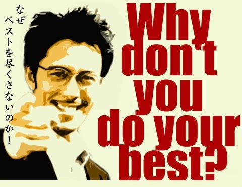

# ML Tutor Material: A ML/DS Tour with CS Lin

This repository contains educational materials and tutorials that were developed while tutoring Machine Learning concepts to CS Lin. These resources provide a practical approach to learning ML/DS

## Table of Contents

- [Optimization and gradient descent without pytorch](week1-a-optim_basics.ipynb)
- [Logistic regression and neural networks](week1-b-from_LR_to_NN.ipynb)
- [Logistic regression as a image segmentator](week1-c-img_seg_LR.ipynb)
- [Basics about PyTorch](week2-torch.ipynb)
- [MNIST classifier](week2-MNIST.ipynb)
- [metrics: accuracy, precision, recall and AUROC](week3_auroc.ipynb)

Why don't you do your best?

